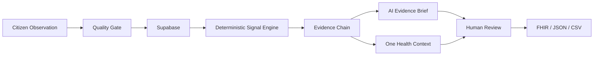

# AquaSignal

From citizen observations to trusted One Health action.

AquaSignal is a prototype environmental intelligence platform that transforms citizen freshwater observations into transparent, traceable environmental patterns that can be explained, reviewed by humans, and exported in interoperable formats.

Built for the IEEE OneAquaHealth Global Hackathon 2026.

## Problem

Citizen observations can expand environmental monitoring but may be incomplete, inconsistent, or difficult to interpret. Valuable community knowledge — photographs, field notes, patterns — rarely reaches decision-makers in a usable form. Without structured evidence, environmental officers struggle to prioritise which sites need attention.

## Solution

AquaSignal adds a transparent validation, pattern-detection, evidence, explanation, One Health context, human-review, and interoperability layer on top of citizen freshwater observations. Community members report what they see. A deterministic rules engine checks quality. Multiple observations at the same site within a time window are evaluated for recurring indicators. If thresholds are met, an environmental signal is generated with a traceable evidence chain. An AI-assisted explanation helps reviewers understand the evidence. Cautious One Health context is provided. Environmental experts review and decide. The evidence package can be exported in interoperable formats.

## Why AquaSignal is Different

AquaSignal combines four principles that are rarely found together:

1. **Deterministic Signal Engine** — Environmental signals are generated by deterministic pattern detection from citizen observations. The evidence-strength metric (0–100) is a transparent pattern metric, not a probability, disease risk, or clinical confidence.
2. **Evidence Chain** — Every signal is traceable to its source observations, indicators, and quality checks. Nothing is hidden. No black boxes.
3. **AI Evidence Brief** — An AI-assisted explanation of existing evidence is generated through a secure Edge Function. If no AI provider is configured, a deterministic fallback is used — clearly labelled as a "Deterministic evidence summary", never presented as AI-generated. AI cannot change evidence strength, source observations, or create signals.
4. **Human Review** — Environmental experts remain responsible for decisions. AI assists with explanation; humans decide.

## OneAquaHealth Alignment

AquaSignal connects citizen science with urban freshwater ecosystem monitoring through a One Health lens. It addresses the challenge of turning fragmented community observations into structured, interpretable evidence that can support environmental and public health decision-making.

The platform acknowledges that the health of freshwater ecosystems, biodiversity, animals, and people are deeply interconnected. One Health context statements are cautious — they do not diagnose disease, establish exposure, or prove causation.

## Tracks

### Primary Track

**Track 3 — AI-Supported Assessment**

AquaSignal's primary alignment is with AI-supported assessment:
- Rule-based quality validation of citizen observations
- Explainable evidence chain for every derived pattern
- AI-assisted explanation of existing evidence (with deterministic fallback)
- Human-in-the-loop review for final decisions

### Supporting Alignment

**Track 2 — Data-to-Insight**

Citizen observations become interpretable environmental patterns through deterministic signal detection.

**Track 7 — Digital Health Standards**

FHIR R4-compatible interoperability export of environmental observation and signal data.

**Track 6 — Resilience Informatics**

Emerging environmental patterns can support early review and follow-up by environmental experts.

AquaSignal does not perform validated prediction. The deterministic signal engine detects patterns in citizen observations — it does not predict disease, outbreaks, or environmental outcomes.

## How It Works

```
Citizen Observation
    → Quality Gate
    → Signal Engine
    → Evidence Chain
    → AI Evidence Brief
    → One Health Context
    → Human Review
    → FHIR / JSON / CSV Export
```

1. **Citizen Observation** — Community members report freshwater conditions: water appearance, odour, flow, visible pollution, vegetation condition, and wildlife observed. Optional photographs can be attached.
2. **Quality Gate** — A deterministic rules engine checks each observation for completeness and internal consistency before it is treated as stronger evidence. Incomplete data is flagged, not hidden.
3. **Signal Engine** — Multiple observations at the same site within a configurable time window (default 48 hours) are evaluated for recurring indicators. If deterministic thresholds are met (minimum 3 observations), an environmental signal is generated with an evidence-strength score (0–100).
4. **Evidence Chain** — Every signal is traceable to its source observations, indicators, and quality checks. Evidence items are explicitly linked, not inferred.
5. **AI Evidence Brief** — An AI-assisted explanation of the evidence is generated through a secure Edge Function. If no AI provider is configured or the service fails, a deterministic fallback is used — clearly labelled as "Deterministic evidence summary", never as AI-generated.
6. **One Health Context** — Cautious contextual statements about why a detected pattern may matter for ecosystem health, biodiversity, and human wellbeing. These are context, not medical diagnoses, disease predictions, or causation claims.
7. **Human Review** — Environmental experts review signals and decide whether to request follow-up, ask for more evidence, or dismiss. AI assists; humans decide.
8. **FHIR Interoperability Export** — The evidence package can be exported as FHIR R4-compatible JSON, native JSON, or CSV.

## Architecture



### Technology Stack

- **Frontend:** React + TypeScript + Vite + Tailwind CSS
- **Backend:** Supabase (PostgreSQL, Storage, Edge Functions)
- **Icons:** Lucide React
- **Routing:** React Router

### Key Services

| Service | Purpose |
|---------|---------|
| `observationService.ts` | Citizen observation submission + photo upload |
| `qualityGate.ts` | Deterministic quality-check rules engine |
| `signalEngine.ts` | Deterministic signal detection from observation patterns |
| `evidenceService.ts` | Signal CRUD, evidence chain, observation linking |
| `aiExplanationService.ts` | AI Evidence Brief generation + deterministic fallback |
| `oneHealthService.ts` | Deterministic One Health context generation |
| `reviewService.ts` | Human review workflow |
| `fhirService.ts` | FHIR R4-compatible export, native JSON, CSV |
| `dashboardService.ts` | Dashboard metrics, site/observation queries |

### Database Tables

- `sites` — Monitoring locations with coordinates
- `observations` — Citizen environmental reports
- `observation_photos` — Photo metadata linked to observations
- `observation_quality_checks` — Quality gate results per observation
- `environmental_signals` — Detected environmental patterns
- `signal_observations` — Signal-to-observation links
- `signal_evidence` — Evidence items supporting each signal
- `signal_ai_explanations` — AI Evidence Briefs (one per signal, upsert)
- `signal_reviews` — Human review decisions (one per signal, upsert)
- `signal_one_health_context` — One Health context statements (one per signal, upsert)

All tables have Row Level Security enabled.

## Responsible AI

- AI assists with explanation of existing evidence. It does not create signals, change evidence strength, or modify source observations.
- The deterministic signal engine establishes the actual observation pattern. AI explains it.
- The deterministic fallback is clearly labelled as "Deterministic evidence summary" and is never presented as AI-generated.
- AI cannot claim medical diagnosis, environmental causation, or confirmed contamination.
- Human reviewers remain responsible for all decisions.
- No AI provider secret is required. If `OPENAI_API_KEY` is not configured, the deterministic fallback is used.

## FHIR Interoperability

AquaSignal supports a **FHIR R4-compatible prototype export** of environmental observation and signal data.

### Resources

- **Observation** — Citizen environmental observations are represented as FHIR R4 `Observation` resources with `status: preliminary`. Each observation uses `Observation.component` for structured fields with `valueString` values. Qualitative citizen selections are never converted to fake numeric measurements.
- **Location** — Monitoring sites are represented as FHIR `Location` resources with name, position (latitude/longitude), and address fields where real data exists. No fabricated addresses.
- **Media** — Observation photographs are represented as FHIR `Media` metadata (not embedded binaries). Each Media resource references its parent Observation and includes the public storage URL where available.
- **Bundle** — All resources for a signal are grouped in a FHIR `Bundle` with `type: collection`.

### Custom Coding System

AquaSignal uses a prototype coding system for environmental concepts:

```
https://aquasignal.app/fhir/CodeSystem/environmental-observation
```

Codes: `water-appearance`, `odour`, `water-flow`, `visible-pollution`, `vegetation-condition`, `wildlife-observed`

Signal types use:

```
https://aquasignal.app/fhir/CodeSystem/environmental-signal
```

### Extensions

- **Evidence Strength** (`https://aquasignal.app/fhir/StructureDefinition/evidence-strength`) — Integer 0-100. Deterministic pattern metric, not a clinical or epidemiological probability.
- **Human Review** (`https://aquasignal.app/fhir/StructureDefinition/human-review`) — Reviewer decision and notes.
- **AI Evidence Brief** (`https://aquasignal.app/fhir/StructureDefinition/ai-evidence-brief`) — AI-assisted explanation with disclaimer.
- **One Health Context** (`https://aquasignal.app/fhir/StructureDefinition/one-health-context`) — Contextual statements, not clinical observations.

### OAH-FHIR Status

The OneAquaHealth FHIR Implementation Guide exists as a **draft CI build (version 0.1.0-ci-build)** at `http://hl7.eu/fhir/ig/oah/`. AquaSignal's export is a **FHIR R4-compatible prototype** and does not claim formal conformance to the draft OAH-FHIR profiles. The OAH IG is still in draft and profiles may change.

### Important Disclaimers

- This is **not** formal HL7 certification or conformance testing.
- This is **not** a validated OneAquaHealth FHIR profile.
- Environmental observations are citizen reports, not laboratory-confirmed measurements.
- The derived signal is a deterministic pattern detection, not a clinical diagnosis.
- One Health context statements are contextual, not medical advice or disease predictions.
- No patient records, medical records, or personal health information are created or exported.
- The export is local and downloadable — no data is uploaded to any external FHIR server.

## Prototype Data / Limitations

- AquaSignal is a prototype. It does not diagnose disease, establish exposure, or prove causation.
- Environmental signals are generated by deterministic pattern detection from citizen observations. They have not been scientifically validated.
- Evidence Strength is a deterministic pattern metric (0–100), not a probability, disease risk, or clinical confidence.
- AI assists with explanation. Environmental experts remain responsible for interpretation and action.
- The FHIR export is a prototype R4-compatible package, not a formally conformant implementation.
- The OAH-FHIR Implementation Guide is still in draft CI build status.
- No authentication is implemented. The prototype uses anon-level Supabase access with RLS policies.
- Prototype data is seeded for demonstration at Riverside Site A. It does not represent a verified real pollution event, laboratory measurements, or disease risk.

## Demo

A guided Golden Demo is available at `/demo`. It walks a judge through the complete product journey using real seeded data at Riverside Site A:

1. Citizen Observation
2. Quality Check
3. Corroborating Observations
4. Emerging Pattern
5. Evidence Chain
6. AI Evidence Brief (or deterministic fallback)
7. One Health Context
8. Human Review
9. FHIR Interoperability Export

The demo uses actual database records. No fake values are generated. If the live AI provider is not configured, the deterministic fallback is shown and clearly labelled.

## Running Locally

```bash
npm install
npm run dev
```

### Build

```bash
npm run build
npm run typecheck
```

## Environment Variables

The following are pre-configured in the Bolt environment:

- `VITE_SUPABASE_URL` — Supabase project URL (public, client-safe)
- `VITE_SUPABASE_ANON_KEY` — Supabase anonymous key (public, client-safe)

AI provider secrets are server-side only and optional:

- `OPENAI_API_KEY` — Optional. If not set, the deterministic fallback is used.

No secret values are exposed in client code or stored in the repository.

## Security

- **Row Level Security:** All 10 database tables have RLS enabled with appropriate policies.
- **Storage:** Observation evidence bucket uses public read access for photo URLs. No credentials are exposed.
- **Edge Function:** The AI Evidence Brief Edge Function runs server-side. Provider secrets are never sent to the client.
- **Client code:** Only public Supabase keys are used. No service-role keys, API keys, or tokens in client code.
- **Exports:** FHIR, JSON, and CSV exports are generated locally in the browser. No data is uploaded to external servers. No secrets or personal data are included in exports.
